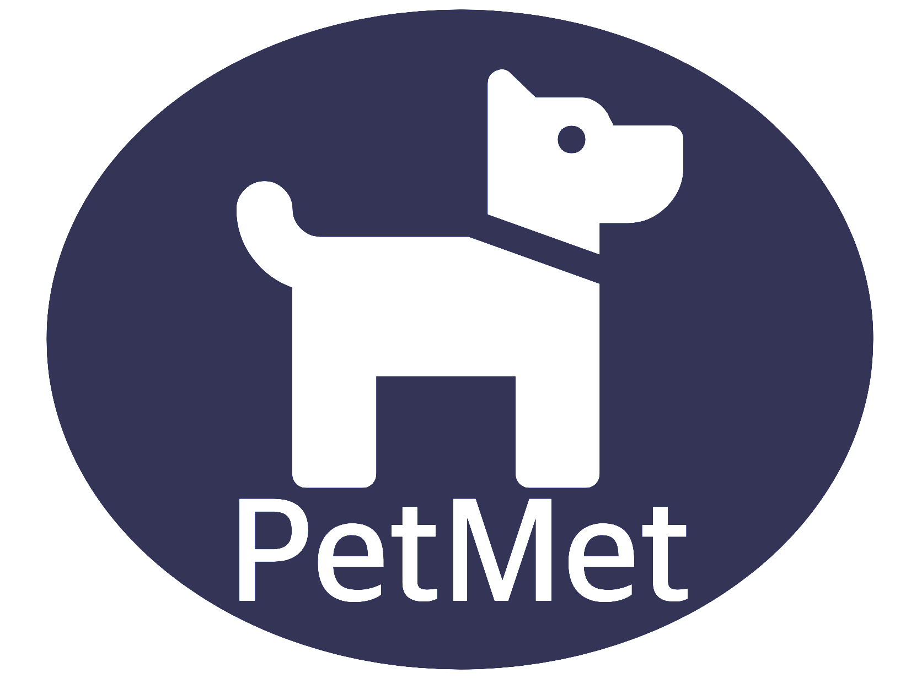
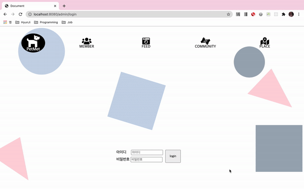

# PetMet

## 📑 프로젝트 소개
- [x] 사랑하는 내 반려견의 사회성을 길러줄 수 있는 반려견 매칭 사이트
- [x] 반려견 1500만 시대지만 환경 미비로 반려견들의 사회성 부족, 또 그로 인해 발생하는 문제들 해결에 초점
- [x] 반려견 매칭과 더불어 커뮤니티, 반려견들과 함께 갈 수 있는 장소 정보 제공을 목표
- [x] JDBC 외에 라이브러리 및 프레임워크 사용하지 않고, 모든 기능 구현에 노력

## 💼설치
- git clone : https://github.com/SunghyunKim9744/PetmetPrj.git

## 🛠 사용 기술

| Front-End      | Back-End       | DataBase | Tool                                       |
| :------------: | :------------: | :------: | :----------------------------------------: |
| HTML5 CSS3 Javascript(ES6) | Servlet & JSP | Oracle    | Git |

## 📅 개발 기간
- [x] 2020.11.02 ~ 2020.12.24 (약 8주)

## 📊 E-R Diagram
### 개념적 모델링

### 논리적 모델링

## 🎞 실행 화면
✅ [1] 로그인

✅ [2] 인덱스 페이지

✅ [3] 카테고리 관리 : 카테고리 등록/수정/삭제 구현

✅ [4] 게시글 관리 : 게시글 목록 조회, 페이저, 게시판 수정 및 게시글 삭제, 검색 구현

✅ [5] 게시글 디테일 : 게시글 디테일, 게시판 수정, 해당 게시글 삭제 구현

✅ [6] 신고된 게시글 관리 : 신고된 게시글 목록 조회, 페이저, 신고 게시글 삭제, 검색 구현

✅ [7] 댓글 관리 : 댓글 목록 조회, 페이저, 댓글 삭제, 댓글 디테일, 검색 구현

✅ [8] 신고된 댓글 관리 : 신고된 댓글 목록 조회, 페이저, 신고 댓글 삭제, 디테일, 검색 구현

## 💻 개발자
|  |  |  |
| :---------------: | :---------------: | :---------------: |
| [이지선](https://github.com/jsl0319) | [김건영](https://github.com/aengun) | [김성현](https://github.com/SunghyunKim9744)|
|  |  |  |
| [김지훈](https://github.com/recordtve)| [김현지](https://github.com/iamhyunji) | [이민영](https://github.com/min-96)|

## 기여
- [x] Front End
	* 카테고리 관리
		- HTML/CSS
		- Javascript : 행 추가/일괄 삭제/일괄 수정
	* 게시글 관리
		- HTML/CSS
		- Javascript : 일괄 삭제/일괄 수정
	* 신고된 게시글 관리
		- HTML/CSS
		- Javascript : 일괄 삭제/일괄 수정
	* 댓글 관리
		- HTML/CSS
		- Javascript : 일괄 삭제/일괄 수정
	* 신고된 댓글 관리
		- HTML/CSS
		- Javascript : 일괄 삭제/일괄 수정
- [x] Back End
	* 카테고리 관리
		- Table, Dao, Service, Controller : 삽입, 삭제, 수정
	* 게시글 관리
		- Table, Dao, Service, Controller : 삭제, 수정
	* 신고된 게시글 관리
		- Table, Dao, Service, Controller : 삭제, 수정
	* 댓글 관리
		- Table, Dao, Service, Controller : 삭제, 수정
	* 신고된 댓글 관리
		- Table, Dao, Service, Controller : 삭제, 수정

## 어려웠던 점
- [x] 학습하면서 프로젝트 진행을 하여 코드의 집중화에 어려움이 있었음
- [x] 처음 웹을 접하니 최대한 모든 기능을 직접 구현하는게 어려웠음
- [x] 테이블 정규화

## 느낀점
- [x] 팀프로젝트를 진행하며, 협업도구의 중요성을 깨달았음
- [x] 학습에 의의를 두어 관리인 페이지에만 집중했는데, 사용자 페이지도 보완하고 싶음
- [x] CRUD 구현 외에 다양한 기능들을 구현해보고 싶음